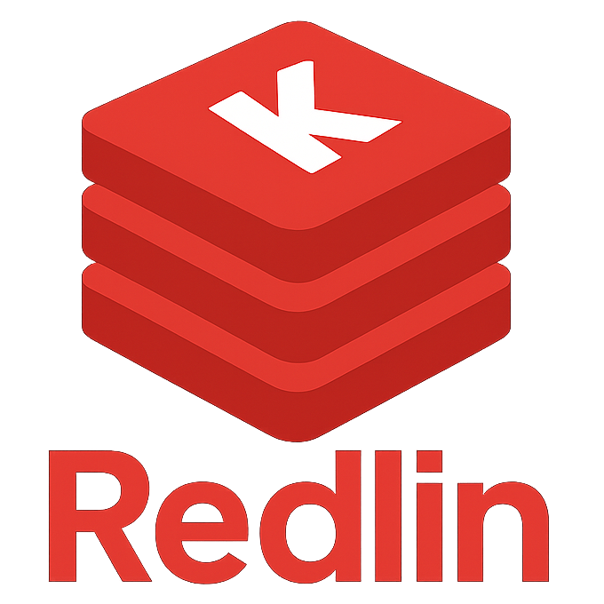

<table>
  <tr>
    <td>
      <h1>Redlin </h1>
      
A <i>very</i> simple Redis implementation.

    </td>
    <td align="right">
      
    </td>
  </tr>
</table>

# Overview

I'm learning Kotlin and after reading [Kotlin: An Illustrated Guide](https://typealias.com/start/) and [Kotlin Design Patterns and Best Practices](https://www.oreilly.com/library/view/kotlin-design-patterns/9781805127765/), I decided to give this a go taking advantage of the structure in the [CodeCrafters challenge](https://app.codecrafters.io/courses/redis/overview).

So take this for what it is: a learning project.

At the moment it is essentially a wrapper for a [ConcurrentHashMap](https://docs.oracle.com/javase/8/docs/api/java/util/concurrent/ConcurrentHashMap.html).

# Run

Run it with `./gradlew run` then you can just use a normal `redis-cli` to communicate with the Redlin server.

## Supported Commands

- GET
- SET
  - Expiration supported with `EX` (seconds) and `PX` (milliseconds)
  - Set only if it does not exist with `NX`
  - Set only if it exists with `XX`
- ECHO
- PING

# To Do

- Add periodic eviction, currently only lazy eviction is supported.
- Implement basic transaction to support [INCR](https://redis.io/docs/latest/commands/incr/).
- Implement support for lists
- Aim to use the coroutines properly and stop using ConcurrentHashMap by potentially implementing an Actor pattern.
- RDB Persistence
- Replication
- Proper logging
- Tests
